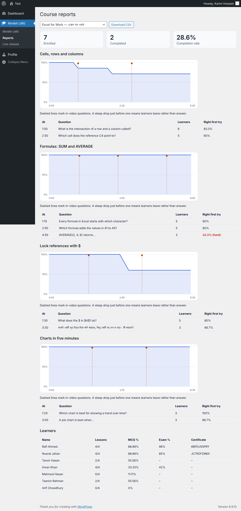
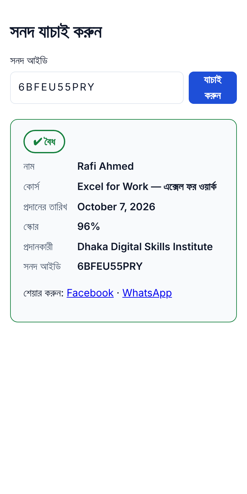

# Nimikh LMS

Implementation of the *Nimikh LMS — Product & Technical Blueprint*: a WordPress LMS built on
**Tutor LMS Pro** with one custom plugin, **`nimikh-lms`**, that adds the differentiators:

- **In-video MCQ pop-ups** (timed, graded server-side, retry / rewind / explanation)
- **Anti-skip video** (seek guard, speed cap, heartbeat validation, gated by required questions)
- **Watch tracking & completion rules** that feed Tutor's native lesson completion
- **Verifiable certificates** (random 10-char code, PDF + SHA-256, public `/verify/{code}`, revocation)
- Learner dashboard / public profile, instructor reports, batch enrolment, admin settings

Phase 2–3 additions (all inside the same plugin):

- **Badges & streaks**, **lesson discussion** (moderated Q&A), **SMS notifications** (Bangladeshi gateways via a URL template)
- **Subscriptions** (plans unlock courses for N days; payment gateways grant access with one action hook)
- **Institute portals** (branded `/institute/{slug}` page, branded certificates, institute admins who only see their own members)
- **Live classes** (Jitsi room created for you, or Zoom/Meet/other link; server-mediated join with attendance; reminders)
- **AI question suggestions** (Anthropic Messages API; drafts the instructor reviews, never auto-saved)
- **PWA** (manifest, service worker, offline page, install button, offline-safe watch progress)
- **Analytics dashboard** (KPI tiles, retention curve with question markers, per-question accuracy)

Also built: **timestamped video notes**, **"Add to LinkedIn / Facebook / WhatsApp" certificate sharing**,
**privacy export & erase** (WordPress Tools + account deletion), a **Bangla (bn_BD) translation** of every learner-facing
string, and a one-click **demo-data seeder**.

Everything else in the blueprint (courses, enrolment, checkout, quizzes/exams, instructor dashboard)
is Tutor LMS configuration, not custom code.

| Instructor reports (demo data) | Public verify page in Bangla | Institute portal |
| --- | --- | --- |
|  |  |  |

See `docs/BLUEPRINT-AUDIT.md` for the blueprint coverage audit and `docs/DEPLOYMENT.md` for server/Cloudflare/monitoring settings.

## Layout

```
nimikh-lms/
  nimikh-lms.php          bootstrap
  src/                    PSR-4 Nimikh\LMS  (Video, Questions, Progress, Certificates, Rest, Admin, Reports, Profile, Integrations/Tutor, Support,
                          Badges, Sms, Discussion, Subscriptions, Orgs, Live, Ai, Pwa, Frontend)
  migrations/             versioned dbDelta schema (001: blueprint 5.3 tables, 002: phase 2-3 tables, 003: notes)
  languages/              nimikh-lms.pot + Bangla (bn_BD) .po/.mo;  tools/ make-pot.php, compile-mo.php (PHP only, no gettext)
  templates/              default certificate + public verify page
  assets/js, assets/css   vanilla-JS player + instructor timeline editor, design tokens (blueprint 9)
  theme/theme.json        the same tokens for the block theme / child theme
  tests/                  unit (PHPUnit), integration (real WordPress), browser (Playwright)
```

## Install

1. WordPress 6.4+, PHP 8.1+ (8.3 recommended), Tutor LMS (Pro for the frontend instructor dashboard).
2. Copy `nimikh-lms/` to `wp-content/plugins/`, then optionally `composer install --no-dev` inside it and
   `composer require mpdf/mpdf endroid/qr-code` for in-process PDF + QR. Without them certificates are
   stored as print-ready HTML (Save as PDF) and show no QR image; a Gotenberg URL in settings also works.
3. **Use pretty permalinks** (Settings → Permalinks → anything but "Plain"). `/verify`, `/institute/{slug}` and the
   PWA files (`/nimikh-sw.js`, `/nimikh-manifest.json`) are rewrite rules and do not work with plain permalinks.
4. Activate. This creates the tables, the `nimikh_instructor` / `nimikh_institute_admin` roles and the rewrite rules.
5. **Nimikh LMS → Settings**: Bunny pull-zone host + token key, issuer name, optional Gotenberg URL.
   Set `DISABLE_WP_CRON` and run a real cron every minute (certificate rendering uses Action Scheduler).

## Continuous integration

`.github/workflows/ci.yml` runs lint, unit tests and JS syntax checks. `.github/workflows/integration.yml` (also weekly, to catch
Tutor/WordPress releases) runs: all three integration suites on **MySQL 8**, the **Tutor contract check and the real-Tutor
test** against the latest Tutor LMS from wordpress.org, the destructive uninstall test, and both browser specs in Chromium.
**These workflows could not be executed where the plugin was written (no network to wordpress.org), so their first run is the
first time the plugin meets MySQL and real Tutor.** Expect to fix small things: the contract check names exactly what
is missing. Run it before upgrading Tutor on production.

## Release build and uninstall

`nimikh-lms/tools/build-zip.sh [dir]` builds `nimikh-lms-<version>.zip` (needs only bash, cp, zip; no tests, tools or dev files).
`WITH_VENDOR=1` also bundles mPDF and the QR library for in-process PDFs. The built zip was installed into a clean copy of the
test site and passed all 211 integration checks. See `CHANGELOG.md`.

Deleting the plugin **keeps all data by default** (certificates are verifiable records). To wipe everything, tick *Delete ALL
Nimikh data* in Settings first; `uninstall.php` then removes the tables, certificate files, options, roles, cron jobs and meta.
The keep-by-default path and the file/role/option removal were tested locally; dropping the tables needs MySQL and is covered
by `e2e-uninstall.php` in the integration workflow.

## Authoring (instructor)

- Course screen → **Nimikh completion rules**: min % watched, min average MCQ %, exam pass mark,
  certificate template, which quiz is the final exam.
- Lesson screen → **Interactive video**: tick *Use the interactive player*, set the Bunny video ID (or a
  direct URL), save, then play the video, pause, click **Add question here**. Markers can be dragged.
- Embed anywhere with `[nimikh_player lesson="ID"]`; lessons with the option on get the player automatically.

## Phase 2–3 features: how to use them

**Reports** (Nimikh LMS → Reports): pick a course; KPI tiles, a retention curve per lesson with dashed lines at each
question, and a per-question table that flags questions under 50% right-first-try. CSV download included.

**Discussion**: appears under every lesson for logged-in learners (turn off in Settings). Course staff can hide or delete
any post; learners can delete their own. A learner's new top-level question emails the course author.

**SMS**: Settings → enable, then paste the gateway's HTTPS URL using `{to}` `{message}` `{sender}` `{api_key}`
(or choose POST). Numbers are read from user meta `nimikh_phone` / `billing_phone` / `phone`, normalised to `8801XXXXXXXXX`
(Bangla digits accepted). Events: enrolled, exam result, certificate issued, live-class reminder. Templates are editable;
learners can opt out with user meta `nimikh_sms_optout`. Delivery is logged in `nimikh_sms_log`.

**Plans & subscriptions** (Nimikh LMS → Plans): create a plan (courses + days), grant by email, or let your payment
integration call `do_action('nimikh_subscription_paid', $user_id, $plan_id, $reference)`. Granting enrols the learner in Tutor;
expiry (hourly cron) cancels only the enrolments the subscription itself created, never a course the learner bought.
Renewing early adds days to the current expiry. `GET /nimikh/v1/plans` is a public catalogue.

**Institutes** (Nimikh LMS → Institutes): create an institute (name, colour, https logo, admin email), assign courses, add
members. Its portal is `/institute/{slug}`; certificates for its courses carry its name, colour and logo, and the public
verify page shows it as the issuer. Institute admins use `/orgs/{id}/enrol` (batch-create + enrol members) and
`/orgs/{id}/report`, which only ever lists that institute's own members. This is single-site multi-tenancy; WordPress
multisite remains the option for tenants that need full isolation.

**Live classes** (Nimikh LMS → Live classes, or `POST /courses/{id}/live`): Jitsi rooms are created automatically
(host configurable); Zoom/Meet/other need an https link. Learners see sessions via `[nimikh_live course="ID"]` and join
through the server 10 minutes before the start, which records attendance; the join link is never in the course listing.
A 5-minute cron emails (and SMS-es) enrolled learners once, within an hour of the start.

**AI suggestions** (Settings → enable + Anthropic API key + model ID): in the lesson's Interactive video editor click
*Suggest questions (AI)*. It uses pasted text or the lesson's WebVTT captions, returns up to 10 draft questions with
suggested timestamps, and the server discards anything malformed (bad option counts or indexes, duplicates, questions in
the first 30 s, ones closer than 30 s). Nothing is saved until the instructor clicks *Review & add*. Transcripts are sent to
the Anthropic API, so the feature is off by default and rate-limited to 10 requests/user/hour.

**PWA**: enabled by default. Adds the manifest link, registers the service worker, and `[nimikh_install_button]` shows an
install button when the browser offers one. Caching is deliberately narrow: plugin CSS/JS and an offline page only. REST
calls, video, wp-admin and login are never cached. Watch progress is kept in `localStorage` until the server acknowledges
it, so a lesson watched on a train syncs when the connection returns.

## Demo data

Nimikh LMS → **Demo data** → *Load demo data* (or `wp nimikh demo seed` / `remove` / `status`). It creates a sample institute
("Dhaka Digital Skills Institute"), 3 bilingual courses (10 lessons, 23 in-video questions, final exams), 2 instructors, and
12 learners who behave differently: finishers (with certificates and badges), mid-course learners, a learner who fails the
exam, drop-offs and starters. You also get discussion threads, learner notes, a subscription plan with two subscribers, and
three live classes (one past, with attendance), so every report and page has something real to show.

- It **refuses to run on a production environment** (set `WP_ENVIRONMENT_TYPE` to `staging`/`local`, or define
  `NIMIKH_ALLOW_DEMO` as `true`).
- Demo users have **no phone numbers** (an SMS gateway can never message a real person), use `example.test` emails, get random
  passwords (shown once), and no email is sent.
- Everything created is recorded, so **Remove demo data** deletes exactly that: users, courses, lessons, questions, enrolments
  (including ones created by the demo subscription), certificates and their files, and the institute and plan. Other content is untouched.
- Lesson videos use a public HLS test stream; override it with the `nimikh_lms_demo_video_url` filter. Open a lesson in the
  editor once to detect its real duration.

## Notes, sharing, privacy, Bangla

- **Notes:** under every interactive video, learners write a note pinned to the current second; clicking a note jumps there
  (never past what they have unlocked). Notes are private, limited to 500 characters and 200 per lesson.
- **Sharing:** the dashboard offers *Add to LinkedIn* (pre-filled certification form), Facebook and WhatsApp for each valid
  certificate. The public verify page carries Open Graph tags and share links for valid certificates only, and stays `noindex`.
- **Privacy:** learners can request their data or its deletion from the dashboard (WordPress's standard request flow, confirmed
  by email and processed under Tools → Export/Erase Personal Data). Deleting a WordPress account erases the same data.
  Erasure deletes progress, answers, notes, badges, streaks, attendance, SMS log and memberships; discussion questions others
  replied to are anonymised; certificates and subscription records are **kept anonymised** (the certificate is revoked, its file
  deleted, and the public page shows no name). Mention this in your privacy policy. Tutor's own data is Tutor's to erase.
- **Bangla:** set the site language to Bangla (বাংলা). All 327 strings are translated: the learner experience (player, questions,
  verify page, dashboard, badges, discussion, live classes, emails) and also wp-admin screens and instructor-facing messages.
  **The translation is a draft: please have a native speaker review it.** To add or change strings: `php tools/make-pot.php`, edit
  `languages/nimikh-lms-bn_BD.po`, then `php tools/compile-mo.php languages/nimikh-lms-bn_BD.po`. A unit test fails if the
  `.mo`/`.pot` are stale or a placeholder is broken. The player loads Hind Siliguri + Inter from Google Fonts; return `false`
  from the `nimikh_lms_google_fonts_url` filter to self-host instead.

## Learner / public pages

`[nimikh_checklist course="ID"]` (what is left before the certificate), `[nimikh_dashboard]` (streak, badges, active subscriptions, certificates, public-profile toggle), `[nimikh_discussion]`,
`[nimikh_live]`, `[nimikh_install_button]`, `[nimikh_profile user="login"]`,
`/verify`, `/verify/{code}`, `/certificate/{code}/download` (owner only).

## REST (`nimikh/v1`)

As in blueprint 6.3, plus `POST /lessons/{id}/duration` (editor sets duration from video metadata) and
`GET /reports/course/{id}?format=csv`. Phase 2–3 adds: `/me/badges`, `/me/subscriptions`, `/me/managed-courses`,
`/lessons/{id}/discussion`, `/discussion/{id}[/hide]`, `/plans`, `/subscriptions[/{id}/cancel]`, `/orgs[/{id}/members|courses|enrol|report]`,
`/courses/{id}/live`, `/live/{id}/join|cancel|attendance`, `/lessons/{id}/ai-questions`. Write routes are cookie+nonce
authenticated and capability-checked.

## Tests

```bash
cd nimikh-lms && composer install
vendor/bin/phpunit -c phpunit.xml.dist                          # 38 unit tests (pure logic, translation guards, Tutor contract checker)
NODE_PATH=$(npm root -g) node tests/browser/player.spec.cjs      # 28 browser checks: player incl. notes (needs ffmpeg + Playwright Chromium)
NODE_PATH=$(npm root -g) node tests/browser/phase23.spec.cjs     # 23 browser checks: PWA offline, discussion, live, reports
php tests/integration/e2e.php                                    # 52 checks on a real WordPress (phase 1)
php tests/integration/e2e-phase23.php                            # 95 checks on a real WordPress (phase 2-3)
php tests/integration/e2e-features.php                           # 65 checks: notes, sharing, privacy, Bangla, demo-data lifecycle
php tests/integration/e2e-gaps.php                               # checklist, next-lesson link, login rate limit (added in 0.1.1, run in CI)
php tools/check-tutor-contract.php /path/to/plugins/tutor        # verifies every Tutor hook/meta/table/column we rely on exists
php tests/integration/e2e-tutor.php                              # real Tutor + MySQL (CI), 35 checks (also dry-run on the stub site)
php tests/integration/e2e-uninstall.php                          # MySQL only: uninstall really drops the tables (destructive, run last)
```

## Blueprint coverage

| Req | Status |
| --- | --- |
| FR-01 – FR-04 in-video MCQ, behaviour settings, anti-skip, watch tracking | Built, tested |
| FR-05 final exam | Tutor quizzes (question bank, timer, attempts, pass mark); exam score read by the rule engine |
| FR-06 completion rule, FR-07 certificate, FR-08 verify page | Built, tested |
| FR-09 learner profile | Dashboard + opt-in public profile built; visual polish left to the theme |
| FR-10 payments | Tutor checkout; SSLCommerz/bKash/Stripe gateway plugins to be installed and configured |
| FR-11 analytics, FR-14 CSV batch enrolment | Built, including the charts dashboard |
| FR-12 Bangla/English | All 327 strings translated (draft Bangla, needs native review) |
| FR-13 notifications | Email + SMS (configurable gateway) for enrolment, exam result, certificate, live-class reminder |
| FR-15 content protection | Signed expiring Bunny URLs + moving dynamic watermark. DRM not included |

## Known limits / things to verify

- **Tutor hook names and storage keys** (`tutor_quiz/attempt_ended`, `tutor_lesson_completed_after`,
  `tutor_action_tutor_complete_lesson`, `_tutor_course_id_for_lesson`, `tutor_quiz_attempts`, …) follow
  Tutor 2.x/3.x conventions but were not run against a real Tutor install (it was not available where this was built).
  All Tutor access is isolated in `Integrations/Tutor/`. `tools/check-tutor-contract.php` and the `real-tutor` CI job check
  every one of these against an actual Tutor; run them, then pin the Tutor version.
- The heartbeat rule is the blueprint's (progress ≤ elapsed × max-rate × 1.1 + 15 s). A learner can still
  idle with the page open and later claim that elapsed time as watched; stricter proof needs a signed
  segment-level scheme.
- Phase 2–3 modules were verified end to end on real WordPress (SQLite) and Chromium, but external services were
  not: no real SMS gateway, Anthropic API, Jitsi/Zoom, or payment gateway was called (they are mocked at the HTTP
  boundary). Check each once with real credentials in staging. The AI request format follows the public Messages API
  (`x-api-key`, `anthropic-version: 2023-06-01`); set the model ID your account has access to.
- Subscriptions are payment-agnostic on purpose: there is no checkout. Connect your gateway to `nimikh_subscription_paid`.
- Institute isolation is application-level (roles + queries scoped to members), not a separate database or site.
- Live classes link out to the provider; there is no embedded video room, recording, or provider-side attendance import.
- The PWA is installable and offline-tolerant but there is no offline video download (HLS segments are deliberately not cached).
- Instructor editor lives on the lesson edit screen. Tutor's React course builder has no stable hook for a
  custom tab, so embedding it there is future work.
- Question text is plain text (no rich text/LaTeX) in this version.
- Not built: native mobile apps (the PWA is the mobile story), **leaderboards (deliberately skipped: ranking learners
  publicly is a privacy and motivation trade-off that needs a product decision)**, WordPress-multisite white-labelling,
  SCORM import, DevOps (Cloudflare, Redis, CI deploy, Sentry).
- The demo seeder writes Tutor-style data (courses, topics, lessons, quizzes, enrolment posts, quiz attempts limited to the
  columns your Tutor schema has) but was run against a Tutor stand-in, not real Tutor. Review it on staging first.
- Privacy erasure covers this plugin's tables. If you log extra personal data elsewhere (analytics, gateway records), erase it there.
